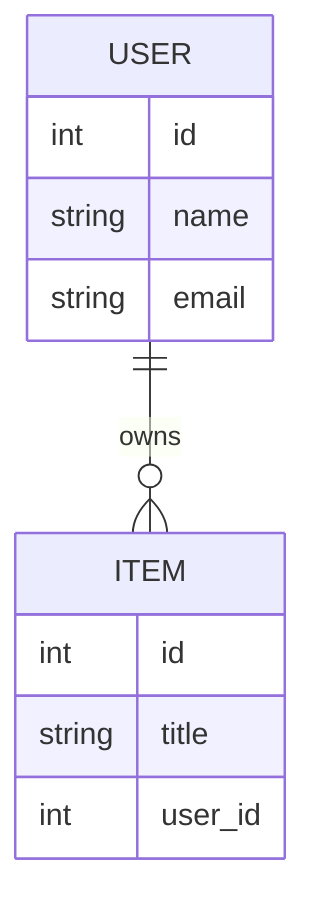
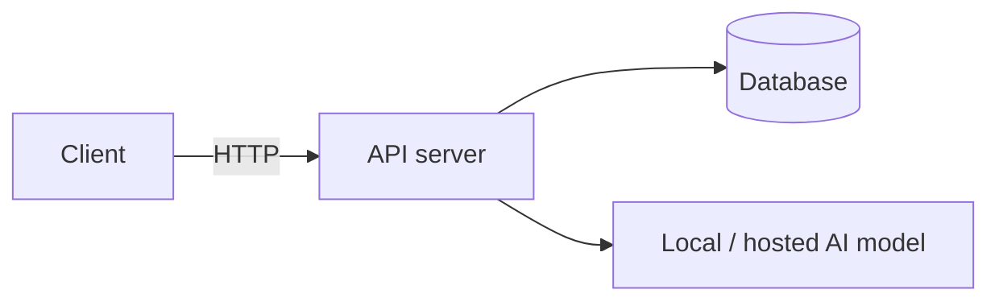

# Architecture

## Overview
One or two sentences: what this project does and who it's for.

## Tech stack
- **Language:** Python 3.x
- **Framework:** (FastAPI / Flask / Django / plain scripts — fill in)
- **Database:** (Postgres / SQLite / none)
- **Frontend (if any):** (React / plain HTML / none)
- **Hosting / deploy target:** (Render / Railway / local demo only)

## Data model

Replace with your actual schema — Mermaid blocks render directly on GitHub, no image tool needed.

## High-level design

## Key decisions and trade-offs
- **Decision 1:** why we chose X over Y, and what we gave up.
- **Decision 2:** ...

## Known limitations
List anything intentionally out of scope for this prototype.
