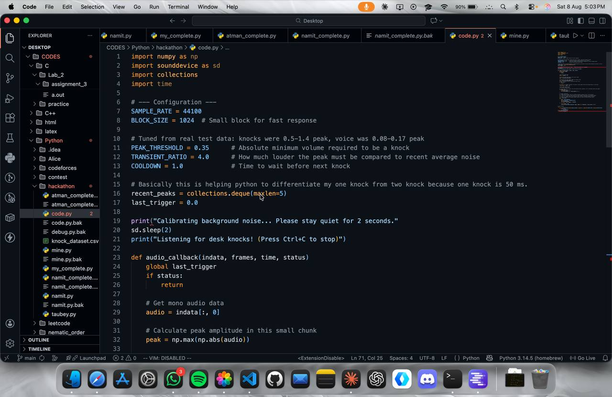

🫰 Snap 'n Fix
Snap your fingers. Let local AI fix your code.

Snap 'n Fix is an autonomous, audio-triggered code repair tool that listens for acoustic snap transients using real-time audio processing and instantly routes your most recently edited code file to a local AI model for automatic bug fixes, formatting, and error resolution.

✨ Features
⚡ Real-Time Transient Detection: Distinguishes physical snap and knock spikes from human voices using Peak, Crest Factor, and Envelope analysis.

📂 Smart Auto-Targeting: Tracks high-precision file modification timestamps (st_mtime_ns) to automatically identify the exact file you just edited.

🔒 100% Offline & Private: Integrates with local LLM engines (via LM Studio) to repair code completely on-device without sending your code to the cloud.

🌐 Multi-Language Support: Out-of-the-box support for Python, C, C++, Java, and header files.

🖥️ Native Editor Focus: Automatically focuses and updates your active file in Visual Studio Code (or your preferred editor).

🛡️ Safe Restores: Creates an automatic .bak backup before applying any AI-generated corrections.

Error File-

🛠️ Requirements & Prerequisites
Python 3.8+

LM Studio (or an OpenAI-compatible local server) running a code model (e.g., google/gemma-4-e4b)

A working Microphone

System Dependencies
Ensure PortAudio is installed on your operating system for real-time audio processing:

macOS: brew install portaudio

Linux (Ubuntu/Debian): sudo apt-get install libasound2-dev portaudio19-dev

Windows: PortAudio binaries are automatically handled by sounddevice.

📂 Supported File Types-
.py(Python)
.c,.h(C)
.cpp,.cc,.hpp(C++)
.java(Java)

🤝 Contributing
Contributions are welcome! Feel free to open an issue or submit a pull request if you'd like to extend acoustic detection profiles, add new language parsers, or support additional editor integrations.
